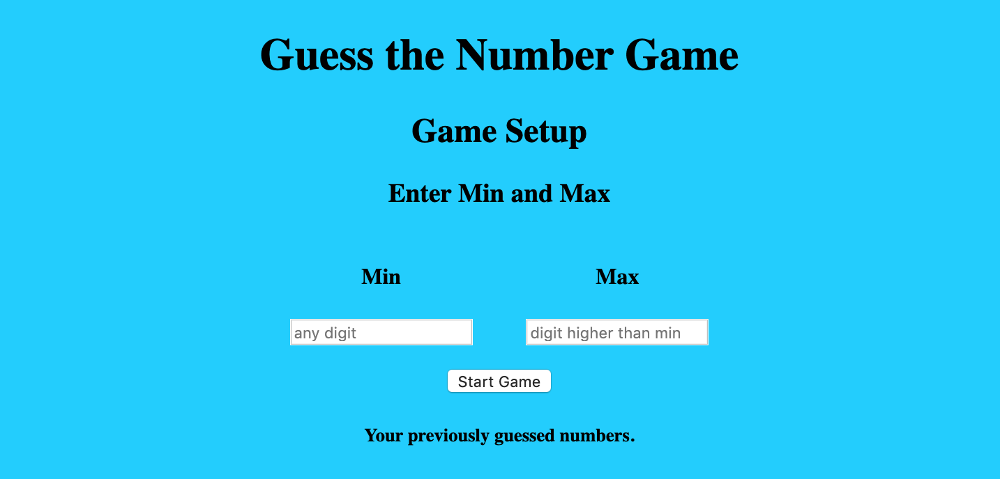

# Guess the Number Game - Simple

All front end.

Link: https://xhaferllari11.github.io/Guess-the-Number-Game/

Screenshot: 

User inputs min and max.

Program gets a randomn number between the min and max.

User keeps guessing until he/she finds the number.

Program tells user whether the guess is too high or too low.